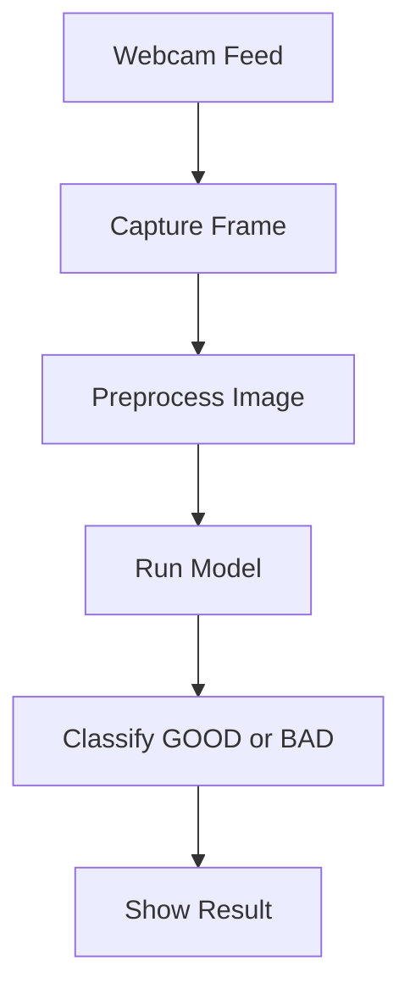

# coffee-bean-classifier

> **Applied AI & Interdisciplinary Integration**  
> *April 2026*

---

##  Overview

This project builds a real-time **coffee bean quality classifier** using a webcam and a deep learning model.  
The system classifies each bean frame as **GOOD** or **BAD** and displays the result with a green/red indicator — simulating an automated optical sorter for coffee production lines.

This prototype was developed during an internal rapid prototyping sprint to validate a computer vision pipeline. The focus was on evaluating:

- Transfer learning using MobileNetV2 for efficient image  classification
- Real-time webcam inference using OpenCV
- Performance benchmarking against a baseline CNN model
- Project structuring, version control, and documentation   using GitHub

---

## Team Members & Roles

| Member         | Role                                      | Key Deliverable                               |
|----------------|-------------------------------------------|-----------------------------------------------|
| **Samuel**     | Systems Architect & Integration Lead      | Webcam verification, inference bridge, **UI optimization** ,Techinical report |
| **Nole**       | Data Science & Performance                | Trained models (MobileNetV2 + CNN), validation ≥ 80%, |
| **Efrata**     | AI Integration & Real-Time Systems        | Inference pipeline, FPS tuning, integration support |

---

## Prerequisites

- Python 3.8+
- Webcam (laptop or USB)
- Git
- VS Code (recommended)

---

## Dataset

We combined public and custom data to ensure robust classification across lighting conditions.

| Source | Details |
|--------|---------|
| Kaggle Coffee Bean Dataset | Base training data with labeled good/bad beans |
| Custom Phone Images | 20–40 images captured under varied lighting for variance |
| Data Augmentation | Brightness shifts, rotation, horizontal flip |

## AI System Architecture Map

---

## System Architecture

##  Models

Two models were trained and compared:

1. **MobileNetV2 (Transfer Learning)**  
   - Input size: 224×224  
   - Normalized pixel values  
   - Frozen base layers + custom dense head  
   - *Primary model*

2. **Simple CNN (from scratch)**  
   - Built for performance comparison  
   - Fewer parameters, faster training

>  Primary model validation accuracy: **≥ 80%**

---
